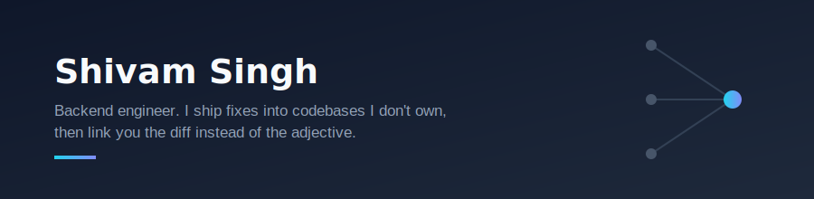

 

I don't think a bio is convincing evidence of anything, so instead of
describing myself, here's what I've actually done — every row below links
to a real diff you can go read right now.
Status is honest:  means it shipped;  means it's an open PR awaiting maintainer review.

## 🔍 Proof, not adjectives

<table>
<tr>
<td width="42%" valign="top"><b>Security is a habit, not a checklist item</b></td>
<td width="58%">
  
Root-caused and fixed a <b>CRITICAL</b> Spring Security CVE + 5 others in <a href="https://github.com/Vault-Web/vault-web/pull/267">Vault-Web #267</a> — one dependency bump, six vulnerabilities closed
</td>
</tr>
<tr>
<td valign="top"><b>I finish things, not just propose them</b></td>
<td>
 
<a href="https://github.com/Vault-Web/vault-web/pull/250">Vault-Web #250</a> — chat UI stability fix 
<a href="https://github.com/Vault-Web/vault-web/pull/244">Vault-Web #244</a> — JVM/Postgres timezone bug
</td>
</tr>
<tr>
<td valign="top"><b>I can navigate and fix a codebase I don't own, at any scale</b></td>
<td>
  
<a href="https://github.com/elastic/elasticsearch/pull/152712">PR #152712</a> — race-condition fix in snapshot lifecycle retries, in the search engine behind a huge share of the internet
</td>
</tr>
<tr>
<td valign="top"><b>Comfortable across the Kafka ecosystem end-to-end</b></td>
<td>
   
<a href="https://github.com/ClickHouse/clickhouse-kafka-connect/pull/775">clickhouse-kafka-connect #775</a> — NPE fix when writing null into a Nullable(JSON) column, merged by ClickHouse 
<a href="https://github.com/ClickHouse/clickhouse-kafka-connect/pull/790">clickhouse-kafka-connect #790</a> — surface the failing column + types on a conversion error (DLQ/JMX, not just logs), merged by ClickHouse 
<a href="https://github.com/kafbat/kafka-ui/pull/1904">kafka-ui #1904</a> — reverse-proxy OAuth bug 
<a href="https://github.com/spring-projects/spring-kafka/pull/4518">spring-kafka #4518</a> — the official Spring project
</td>
</tr>
<tr>
<td valign="top"><b>Distributed systems as trade-offs, not diagrams</b></td>
<td>
 
Built <a href="https://github.com/29shivam/system-design-tradeoffs">system-design-tradeoffs</a> from scratch — every answer is a trade-off matrix, real Spring Boot/Kafka/Redis code, and a production incident
</td>
</tr>
</table>

## 🚧 Currently building

**[system-design-tradeoffs](https://github.com/29shivam/system-design-tradeoffs)**
— most interview prep hands you a diagram and calls it the answer. This
doesn't: every question is a trade-off matrix, a mock interview transcript
showing the real follow-up drilling, a production incident, and buildable
Spring Boot/Kafka/Redis/Postgres code behind the chosen approach.

**aphno.ai** &nbsp;·&nbsp; **alpcove** — two new projects in progress; deeper
write-ups landing here soon.

## 💼 Selected production work

- **Trade allocation engine** — Java, Kafka, Redis, PostgreSQL — high-throughput pipeline processing real-time financial transactions
- **Real-time Kafka pipeline** — AWS MSK, Flink, EKS — 40% throughput improvement on event-streaming infrastructure
- **Live MySQL → PostgreSQL migration** — zero downtime, zero data loss, across live production services
- **Microservices security hardening** — Spring Boot, JWT, API Gateway — auth hardening across a distributed service mesh
- **Book management REST API** — Spring Boot, PATCH-based versioning — clause versioning & metadata endpoints for a document assembly system

## 🛠️ Stack

**Backend**

**Cloud & DevOps**

**Data & Messaging**

**Frontend**

## 📈 Contribution activity

A hand-built animated SVG — my real merged open-source PRs, revealed like a live <code>git log</code>. Not a widget.

  

Custom-built from my live GitHub data, regenerated daily by a GitHub Action — not an off-the-shelf widget.

---

If you've got an interesting distributed-systems or backend problem, that's
the fastest way to get my attention — **[LinkedIn](https://linkedin.com/in/29shivam) is open.**

